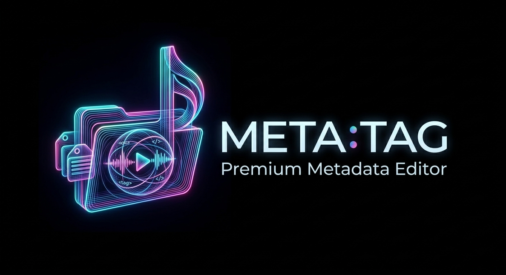

# MetaTag v1.3.0

**Professional-Grade Audio & Audiobook Metadata Management Suite**

  

MetaTag is a powerful, cross-platform audio tagging application designed for music collectors, DJs, researchers, and audiobook lovers. Built with Python and PySide6, it offers a high-performance Model/View architecture capable of handling massive libraries with zero latency.

---

## 🚀 Key Features

### 🎧 Audio & Audiobook Tagging
- **Multi-Format support**: Edit tags for MP3 (ID3v1/v2), FLAC, M4A/MP4 (iTunes), Ogg Vorbis, Opus, WAV, and AIFF.
- **Specialized Audiobook Engine**: Integrated support for fetching **Narrators**, **Series**, and **Book Descriptions** via the Audnexus API.
- **Intelligent Field Mapping**: 
  - Narrator → `Composer`
  - Series Name → `Grouping`
  - Book Description → `Comment`
- **Batch Editing**: Simultaneously update metadata across hundreds of selected tracks.
- **Undo/Redo System**: Full session-wide undo/redo support for all tag edits and file operations.

### 🔍 Online Metadata & Discovery
- **Audnexus Integration**: Specialized lookup for audiobooks with high-resolution book covers.
- **MusicBrainz Integration**: Fetch official tracklists and album information using the MusicBrainz API (with custom mirror support).
- **Discogs Lookups**: Connect your personal account via API tokens for high-rate limit metadata searches.
- **Adaptive Cover Art Finder**: Automatically download and resize album art to your preferred resolution (e.g., 800px) during import.

### 🛠️ Advanced Automation
- **Tag from Filename**: Extract metadata from complex folder/file structures using custom patterns.
- **Batch Renaming**: Organize your library on disk by renaming files based on their internal tags (Artist - Album - Track - Title).
- **Instant Filter**: A high-speed search bar that isolates tracks as you type.
- **Attribute Preservation**: Choose to **Preserve File Modification Timestamps** to keep your library's history intact.

### 🎨 User Interface
- **Sleek Dark Theme**: A premium design that reduces eye strain during long sessions.
- **Customizable Editor**: Toggle and reorder tag fields (BPM, Composer, Grouping, etc.) to match your workflow.
- **Integrated Audio Player**: Preview tracks instantly without leaving the application.

---

## 💻 Tech Stack & Repository
- **Language**: Python 3.14+
- **UI Framework**: PySide6 (Qt 6)
- **Metadata Engine**: Mutagen
- **GitHub**: [https://github.com/3453-315h/MetaTag](https://github.com/3453-315h/MetaTag)

---

## 🛠️ Usage

### Installation
MetaTag is provided as a standalone, portable application. Simply run the `MetaTag.exe` from the `dist` directory or use the provided installer.

### Configuration
Access the **Settings** menu to configure your preferences:
- **General**: Toggle Auto-save, set intervals, and enable Session Restoration.
- **Online**: Enter your Discogs Token or custom MusicBrainz/Audnexus mirrors.
- **Files**: Define recursive scanning behavior and set folder history limits.

---

## 📜 License
This project is licensed under the MIT License - see the LICENSE file for details.

---
*Developed by MetaTag Team — Precision Metadata for Professional Libraries.*